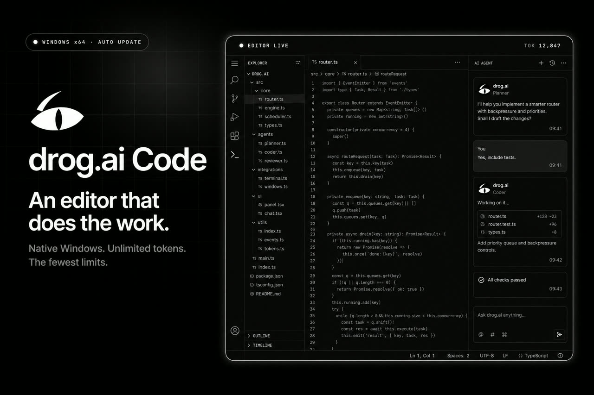
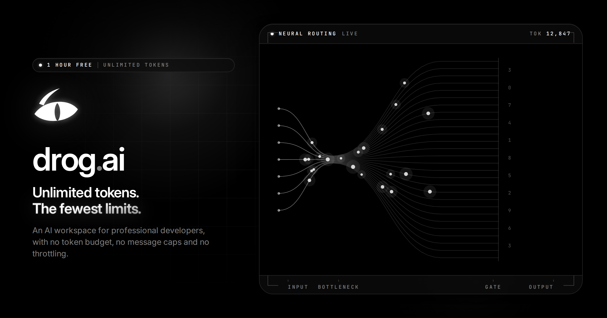
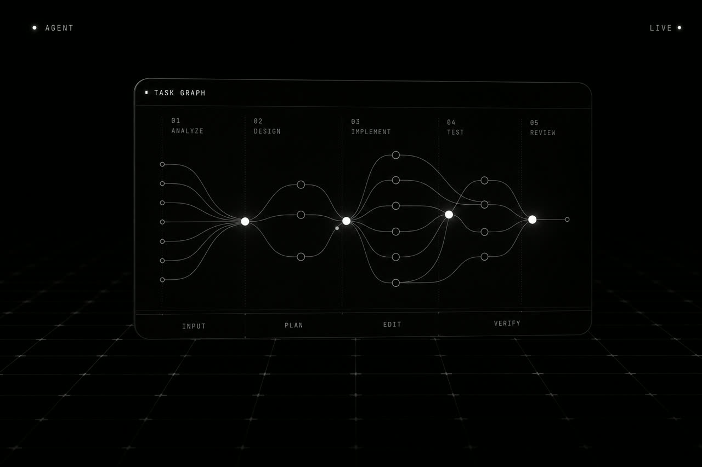
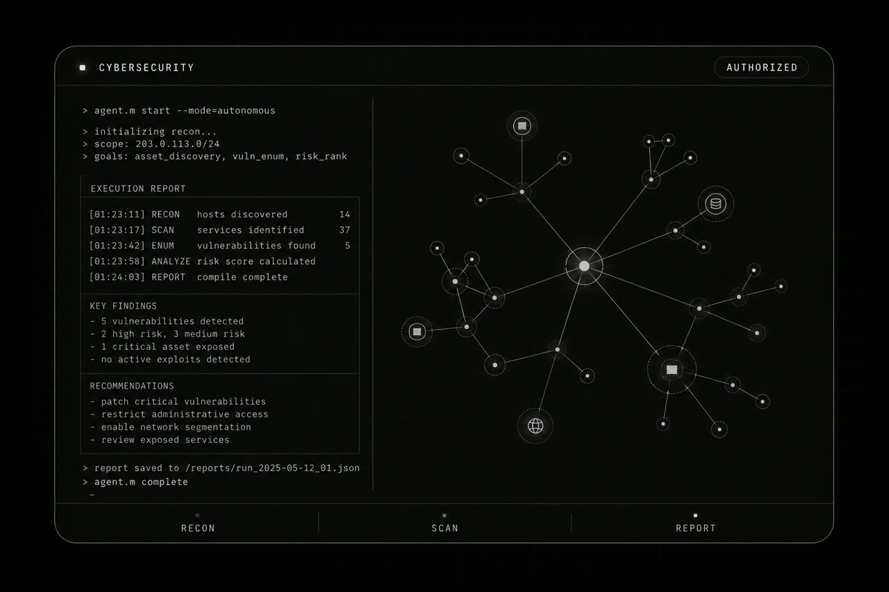
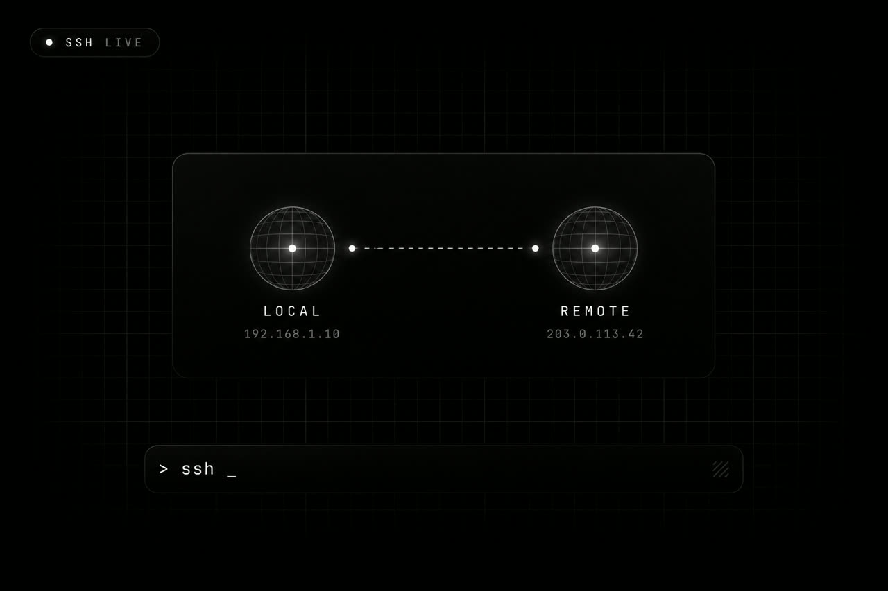
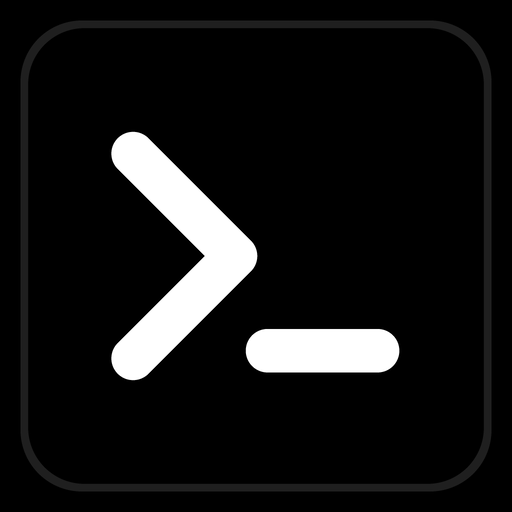

<div align="center">


# drog.ai Code

**An editor that does the work.**

A native Windows application — not a webpage in a frame.<br/>
Unlimited tokens. The fewest limits.

<br/>

[](https://github.com/deepdrogo/drogai_windows_editor_releases/releases/latest)
[](https://github.com/deepdrogo/drogai_windows_editor_releases/releases)
[](#download)
[](#automatic-updates)

<br/>

<a href="https://github.com/deepdrogo/drogai_windows_editor_releases/releases/latest"></a>
&nbsp;&nbsp;
<a href="https://drog.ai"></a>

<br/><br/>



</div>

---

<div align="center">

### The official release channel

Every installer and every automatic update is served from this repository.<br/>
The source is private. The product lives on [drog.ai](https://drog.ai).

</div>

---

<div align="center">

</div>

<br/>

**drog.ai** is an AI workspace for professional developers: no token budget, no message caps, no throttling. **drog.ai Code** is the desktop editor for that workspace — the same account, the same conversations, on your machine.

A native application. It starts immediately and stays out of the way while it runs.

---

## An editor that does the work

<table>
  <tr>
    <td width="33%" valign="top">
      
      <br/>
      <strong>The whole repository in context</strong>
      <br/>
      It indexes the project you opened, not the file you happen to be looking at, and edits across as many files as the change actually touches.
    </td>
    <td width="33%" valign="top">
      
      <br/>
      <strong>CyberSecurity, when you need it</strong>
      <br/>
      Live penetration-testing tooling and SSH sessions inside the editor. Findings written up as you go. Unlocked per account from the drog.ai admin panel.
    </td>
    <td width="33%" valign="top">
      
      <br/>
      <strong>Remote work, first-class</strong>
      <br/>
      Open a folder over SSH. The editor, the terminal, search and language servers all run against the remote host — as if it were local.
    </td>
  </tr>
</table>

<br/>

| | |
| --- | --- |
| **It runs what it writes** | An integrated terminal the agent can drive: build it, test it, read the failure, fix it. You watch, and you stop it whenever you like. |
| **Your machine, your code** | Conversations and files stay local. The gateway meters tokens and decides entitlement — it never receives your project. |
| **The account you already have** | Sign in with the same credentials as the web workspace. Your conversations are the same conversations. |
| **Installs without admin rights** | One installer, per user. Nothing to elevate, no runtime to download first, no reboot at the end. |
| **Updates itself, signed** | Releases are published with a detached signature. The app verifies it before installing. No installer to chase. |
| **No keys on your machine** | The drog.ai gateway owns authentication and metering. There is no provider key in the binary, the settings, or the installer. |

Monaco at the core — splits, tabs, breadcrumbs, a file tree, fuzzy open, find in files, LSP, diagnostics, and a real ConPTY terminal. Plus MCP tools and a browser tool, when the work needs them.

---

## Five modes

The mode is not a personality setting. It decides how much of the repository reaches the prompt, whether the work is split into stages, when a restore point is written, and what happens to the conversation as it grows.

| | **Plain** | **Checkpoint** | **Agent** | **Long task** |
| --- | --- | --- | --- | --- |
| Reads | open file | open tabs | whole repository | whole repository |
| Edits / commands | no | yes | yes | yes |
| Plans | no | in its head | in its head | explicit task graph |
| Restore point | — | every step | every edit | every stage |
| History | verbatim | digested | digested | dropped each stage |

**Plain** is one call: the open file, your selection, and nothing else.

**Checkpoint** writes a restore point after every step. The timeline rewinds the files to any point without deleting the transcript.

**Agent** plans for itself and repairs its own mistakes — inspect, plan, edit, test, read the errors, continue. This is the default.

**Long task** is for a job too big for one prompt. Each stage is its own small conversation, so stage forty's prompt is the same size as stage one's.

A fifth mode, **CyberSecurity**, is off until the account carries the grant. It is a server-side capability, not a setting.

---

## Download

Windows 10 (1809+) and Windows 11, x64. About 25 MB installed.

1. Open the **[latest release](https://github.com/deepdrogo/drogai_windows_editor_releases/releases/latest)**.
2. Download **`drog.ai_Code_<version>_x64-setup.exe`**.
3. Run it — per-user, no administrator rights.
4. Launch **drog.ai Code** and sign in with your [drog.ai](https://drog.ai) account.

Deploying by policy? Every release also ships an **MSI**.

Every build is published with its SHA-256 digest, so you can confirm the file you received is the file we made.

<div align="center">
  <a href="https://github.com/deepdrogo/drogai_windows_editor_releases/releases/latest"></a>
</div>

---

## Automatic updates

On launch — and whenever you ask — the app reads the newest release from this repository.

```
drog.ai Code  →  latest.json  →  verify signature  →  install
```

A newer version offers a one-click **Install**. Already newest, it says you are up to date. An unsigned or mis-signed package is refused, not installed with a warning.

You never have to re-download by hand after the first install.

---

## What’s in each release

| Asset | Purpose |
| --- | --- |
| `drog.ai_Code_<version>_x64-setup.exe` | Windows installer (per-user, NSIS) |
| `drog.ai_Code_<version>_x64_en-US.msi` | MSI, for managed / policy deployment |
| `latest.json` | The updater manifest the app reads |
| `*.sig` | Detached minisign signature |

---

## Source & licensing

The application is proprietary. This repository distributes **release artifacts only**. See each release’s notes for what changed.

Access is personal and granted individually — from a free one-hour demo to a full month on [drog.ai](https://drog.ai). Unlimited covers one person working.

<div align="center">



<br/>

[drog.ai](https://drog.ai) · [Download](https://github.com/deepdrogo/drogai_windows_editor_releases/releases/latest) · [Latest release](https://github.com/deepdrogo/drogai_windows_editor_releases/releases/latest)

<sub>© 2026 drog.ai · Built for Windows</sub>

</div>
